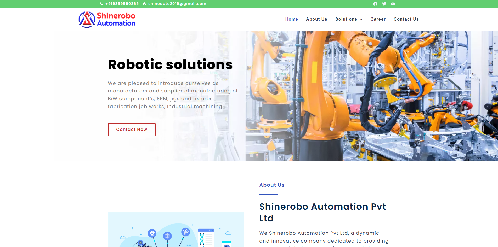

# ShineAuto

- **Client:** Mr. Sunil Magar
- **Website:** [shineauto.smartscriptstech.com](https://shineauto.smartscriptstech.com/)
- **Tech Stack:** PHP, MySQL, WordPress, WooCommerce, Elementor, Astra Theme
- **Category:** Business Website

### 🏢 About the Client

Shinerobo Automation Pvt Ltd is a progressive organization with expertise in the design and production of BiW components, jigs & fixtures, fabrication structures, and industrial machining. They are known for their precision engineering and a high focus on innovation, serving clients in India as well as abroad.

### 🎯 Objectives

The client needed a modern, responsive, and informative website to:

- Reflect their technical expertise and industrial capabilities
- Showcase a wide portfolio of services and manufacturing solutions
- Establish a strong online presence for domestic and international clients
- Enable seamless customer engagement through a structured layout and contact interface

### 🚧 Challenges Faced

- **Complex Content Structure:** The wide range of services required detailed categorization without overwhelming the user.
- **Technical Language Simplification:** Finding a balance between industry-specific terminology and easy-to-understand descriptions was essential for successful communication.
- **Visual Representation of Industrial Work:** Communicating the quality and accuracy of their manufacturing processes through web design and imagery.
- **Performance Optimization:** Achieving quick loading speed in spite of high-quality media and graphics.

### 💡Our Approach

We employed WordPress with Elementor and the Astra theme to create a clean, modular, and scalable website that can expand with the company.

- **Design:** Used a professional, clean design with industrial-inspired graphics to mirror the company's field.
- **Navigation:** Organized a simple menu with separate sections for Services, About Us, Gallery, and Contact to navigate users easily.
- **WooCommerce Integration:** Included potential for future scalability in e-commerce if the company wants to display or sell parts online.
- **SEO & Speed:** Compressed images and scripts to provide smooth functionality and better search engine visibility.

### Key Features Delivered

- Mobile-Responsive and Cross-Browser Compatible Design
- Clean UI/UX for technical and non-technical visitors
- High-Performance Hosting & Page Load Speed
- Inquiry Form with Contact Details & Google Maps Integration
- Future-ready structure for blog or product additions

### 📈 Results  

The new site has greatly improved the digital presence of Shinerobo Automation. It is now a solid platform for online marketing, customer interaction, and brand credibility. With better usability and aesthetics, the site positions Shinerobo as a trusted brand in the engineering and industrial manufacturing industry.
